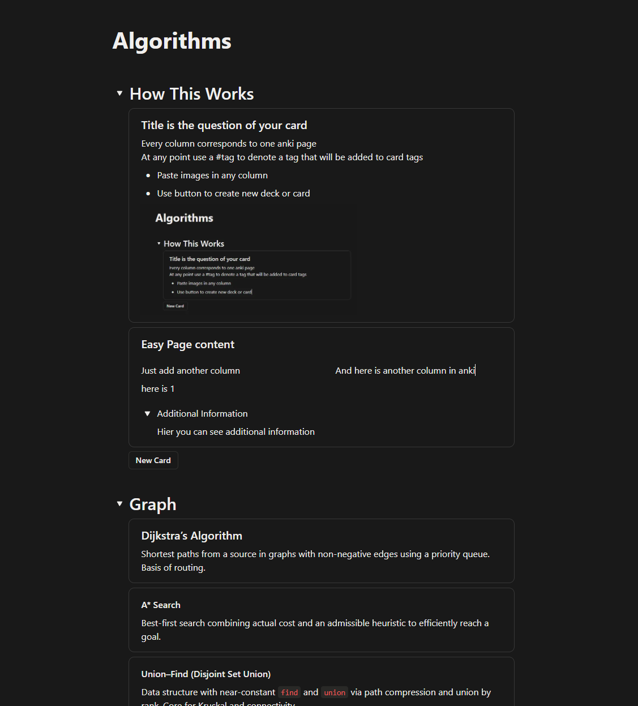
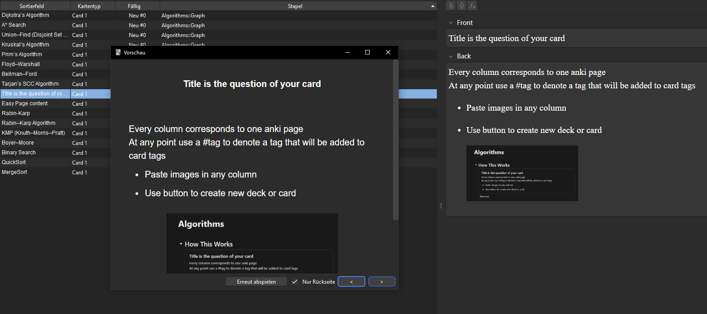

# Notion to Anki Converter

Do you want to write a clean sumamry? Or do you want to create the next 1000 card anki deck? \
This script allows you to do both!

Easily convert Notion exports to Anki flashcard decks (.apkg) or CSV files.

## Features

- Convert Notion HTML exports to Anki decks
- Support for ZIP file exports
- Download directly from Notion hosted pages (requires Selenium)
- Subdeck organization based on details/summary elements
- Callout blocks → flashcards
- Hashtag extraction for tagging (#tag)
- Media support (images, audio)
- Preserves Notion CSS styling

## Example
Just write your Notion page as a summary using callout blocks for each flashcard.


[](./showcase/notion.png)

Export as html and convert:

```bash
python notion_import.py -f Example.zip -o Example.apkg
```

[](./showcase/anki.png)

## Formatting

- Page Title → Deck Name
- Details/Summary block → Subdeck
- Callout block → Flashcard
  - First element inside callout → Card Front
  - Remaining content inside callout → Card Back
  - Includes images in card back
  - Hashtags (#tag) → Anki Tags
  - Preserves Notion styling (bold, italics, code, etc.)

## Installation

```bash
# Basic requirements
pip install beautifulsoup4 genanki

# For downloading from Notion URLs (optional)
pip install selenium
```

## Usage

### From HTML file
```bash
python notion_import.py -f Algorithms.html -o output.apkg
```

### From ZIP export
```bash
python notion_import.py -f notion_export.zip -o output.apkg
```

### From Notion hosted page

**⚠️ IMPORTANT:** Notion hosted pages load content dynamically and may not include all nested content (details/toggle blocks, callouts). For best results, export your page as HTML first.

```bash
# This may work for simple pages, but nested content might be missing
python notion_import.py -f https://your-page.notion.site/Page-ID -o output.apkg
```

**Recommended approach:**
1. Open your Notion page
2. Click the `...` menu → `Export`
3. Choose `HTML` format
4. Select `Include subpages`
5. Download the ZIP file
6. Use the ZIP file with this script:
```bash
python notion_import.py -f exported_page.zip -o output.apkg
```

### Export to CSV (for inspection)
```bash
python notion_import.py -f input.html -o output.csv
```

### Tag handling
```bash
# Keep hashtags in card text (default)
python notion_import.py -f input.html -o output.apkg --keep-tags

# Remove hashtags from card text (but still use as Anki tags)
python notion_import.py -f input.html -o output.apkg --remove-tags
```

## Files

- **notion_import.py** - Main script for converting Notion to Anki
- **download_notion_page.py** - Separate module for downloading Notion hosted pages
- **card_style.css** - Custom CSS styling for Anki cards

## Structure

Notion pages should be structured as follows:

```
Page Title (becomes deck name)
├── Details/Summary block (becomes subdeck)
│   └── Callout blocks (become cards)
│       ├── First element → Card front
│       └── Remaining content → Card back
└── Standalone callouts (go to Default subdeck)
```

## Requirements

- Python 3.7+
- beautifulsoup4
- genanki
- selenium (only for URL downloads)
- Chrome/Chromium browser (only for URL downloads)
